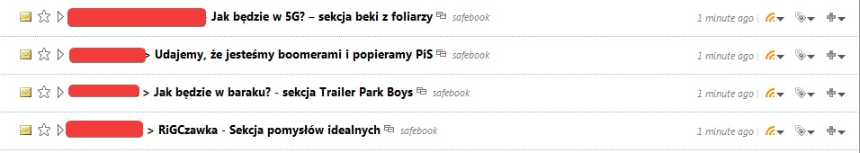

## safebook

My old project created at the end of August 2020 which transforms Facebook wall into RSS feed

**Notice: previously this project was private before I decided to publish it and this project was not intended to be public; at the time of publishing it (November 2021) safebook may just not work anymore. use at your risk**

### Why?

1. because Inspiration

I was inspired by a created few months earlier post on a Facebook group in which autor wanted to *escape* from Facebook by parsing Facebook to RSS feeds, however the source code was not publicly available so I decided to write my own implementation using node.js and Puppeteer

2. because I recently found this project on my hard drive and decided to share it as it may be useful to someone
3. to reduce Facebook tracking
4. because fuck Facebook

### Getting Started

```shell
$ mv config.json.example config.json
$ $EDITOR config.json # insert your FB login data, idk if it works with 2fa
$ npm install
$ npm start
```

### safebook in action*



*not up-to-date screenshot taken in adware RSS reader FeedDemon

### License

safebook is licensed under [WTFPL license](LICENSE)

